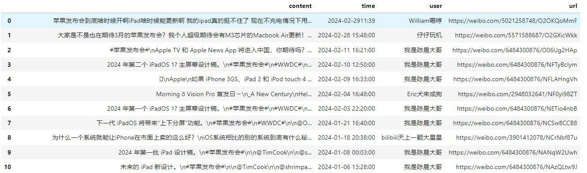

<!-- PROJECT LOGO -->
<br />
<div align="center">
  
  

  <h3 align="center">Weibo_Spider</h3>
  <p align="center">
    ^_^对微博话题和用户进行爬取^_^
  </p>
</div>


<!-- ABOUT THE PROJECT -->
## About The Project

本项目利用python对微博话题和用户进行爬取，同时利用FastAPI进行API的搭建。

**配置文件为config.json**
* headers 不需要更改
* cookies 获取方式：进入微博官网(https://weibo.com/), 登录后,F12进入开发者模式，选取Network，Ctrl+R 重新加载，在Name中点击第一个weibo.com，就会有cookies
* page (int 类型） 代表要爬取的页数
* user_id (int类型）：用户的Id
* query ：要查询的话题


<!-- GETTING STARTED -->
## Getting Started

### Prerequisites

首先安装环境依赖库，对于FastAPI,推荐安装所有的可选依赖及对应功能
* BeautifulSoup
  ```sh
  pip install beautifulsoup4
  ```
* FastAPI
  ```sh
  pip install "fastapi[all]"
  ```

### Installation


Clone the repo
   ```sh
   git clone https://github.com/CUTEPKQ/Web-Spider.git
   ```


<!-- USAGE EXAMPLES -->
## Usage
1. 在*config.json*文件中
   * 将weibo_cookies更换为自己的cookies
   * query修改为要查询的话题
   * page 代表要爬取的页数（一页十条数据）
   * user_id 微博用户的id,点击用户主页（以浙江大学为例，进入主页，查看网址为https://weibo.com/u/1851755225，所以user_id为1851755225）
2. 运行
   * 运行*main.py*文件，可以得到爬取的数据（评论内容、评论时间）
     * 爬取的话题信息为 [话题内容,时间,用户昵称,话题网址]
       
     * 爬取的用户信息为 [话题内容,时间]
       
       
3. API服务(暂未更新user，仅支持话题）
   * 运行*api.py*文件，启用api服务（默认host为localhost,端口号为9394，使用前请**确保该端口未被占用**）
   * 运行*api_test.py*文件，验证api
     

   
  


<!-- ACKNOWLEDGMENTS -->
## Acknowledgments
* 参考博客(https://blog.csdn.net/m0_72947390/article/details/132832280)


